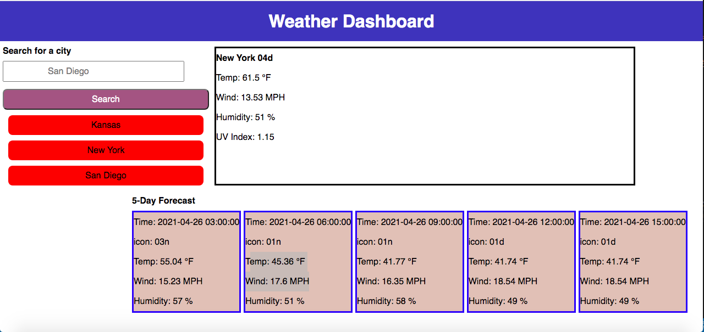

# 06_Weather_Dashboard

#### Weather-Dashboard is Intended to Assist You with Your Travel Plans. 

Weather-Dashboard is friendly app that asks you to enter a name of city and in return, it will give you the current weather conditions for that city such as: temperature, humidity, wind speed, UV index, and date. Moreover, it will also give you the weather conditions for the days ahead.

## technologies used
1. HTML
2. CSS
3. javaScript

## link to this app
https://abdale88.github.io/06_Weather_Dashboard/

## license and copyrigh

MIT License

Copyright (c) 2021 Abdale Hassan

Permission is hereby granted, free of charge, to any person obtaining a copy
of this software and associated documentation files (the "Software"), to deal
in the Software without restriction, including without limitation the rights
to use, copy, modify, merge, publish, distribute, sublicense, and/or sell
copies of the Software, and to permit persons to whom the Software is
furnished to do so, subject to the following conditions:

The above copyright notice and this permission notice shall be included in all
copies or substantial portions of the Software.

THE SOFTWARE IS PROVIDED "AS IS", WITHOUT WARRANTY OF ANY KIND, EXPRESS OR
IMPLIED, INCLUDING BUT NOT LIMITED TO THE WARRANTIES OF MERCHANTABILITY,
FITNESS FOR A PARTICULAR PURPOSE AND NONINFRINGEMENT. IN NO EVENT SHALL THE
AUTHORS OR COPYRIGHT HOLDERS BE LIABLE FOR ANY CLAIM, DAMAGES OR OTHER
LIABILITY, WHETHER IN AN ACTION OF CONTRACT, TORT OR OTHERWISE, ARISING FROM,
OUT OF OR IN CONNECTION WITH THE SOFTWARE OR THE USE OR OTHER DEALINGS IN THE
SOFTWARE.

